# 1.TCP服务模型

Internet上绝大部分应用使用的都是TCP（Transmission Control Protocol），TCP提供**可靠的、端到端的、有序的、双向字节流**服务。

应用会将需要传输的数据传递至TCP，TCP会对数据进行分段，称之为TCP Segment，之后TCP传递segments给IP层，IP层将其封装在IP数据报中。IP数据包随送至Link层进一步封装为Link帧（frame），随后发送出去。

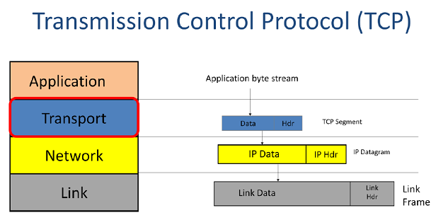

当两个应用使用TCP，它们间会建立双向通信通道。首先TCP建立从A到B的通信通道，随后建立从B到A的通信通道。这样的双向通信称之为**连接（connection）**。在连接的两端，TCP 维护一个状态机以跟踪连接的状态。

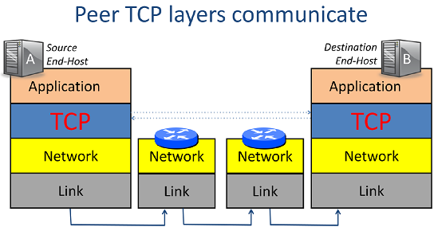

## 1.1 三次握手

TCP通过**三次握手（three-way handshake）** 来建立主机A和B之间的连接。

- **第一次握手**：首先主机A发送建立连接请求（SYN message，SYN是Synchronize的简写）。在SYN message中还包含了主机A的序列号，即通信的起始报文序列号。
- **第二次握手**：主机B响应SYN+ACK。主机B对主机A的请求恢复ACK，表示同意建立从A到B的通信。此外，主机B同样发送SYN请求建立从B到A的通信，主机B同样也会告知对方通信的起始报文序列号。
- **第三次握手**：A响应ACK，表示同意建立从B到A的反向连接。

经过三次握手，双方便建立了双向连接，之后便可以进行数据交换了。

## 1.2 四次挥手

TCP通过**四次挥手**来关闭通信双方的连接。

- **第一次挥手**：主机A上的TCP层通过发送一个FIN（FINISH的缩写）消息来关闭连接。
- **第二次挥手**：主机B对FIN消息进行确认，即A不再有数据发送过来，关闭从A到B的数据流。但B可能仍然有数据需要发送给A，此时B不会立即请求关闭从B到A的通道。因此，此时B仍然能发送数据给A。
- **第三次挥手**：当B完成将数据发送给A后，同样向A发送FIN消息，请求关闭从B到A方向的连接。
- **第四次挥手**：主机A收到FIN请求后会回复ACK，然后关闭从B到A方向的连接，至此TCP连接被彻底关闭。

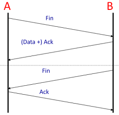

## 1.3 TCP服务属性

下表总结了TCP提供的服务

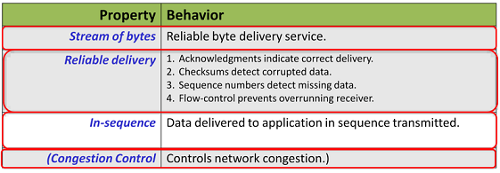

表中前3个服务是TCP为应用程序提供的服务，也就是可靠的字节流服务。

**可靠性**指数据被正确传送，TCP使用4个机制来保证可靠性：

- 当TCP层接收到数据时，它会发送一个**确认（acknowledgement）** 给发送方，以通知其数据已经正确到达。
- TCP头携带一个覆盖段内头部和数据的**校验和（checksums）**。校验和的作用是检测段是否在传输过程中被损坏，例如由于电线上的位错误或路由器内存故障等原因。
- **序列号**可以检测数据的确实。每个TCP段的头部携带了该段内第一个字节在字节流中的序列号。若某个段丢失了，将不会收到对方的ACK确认。若确认丢失，发送方需要重新发送数据。
- **流量控制（Flow-control）** 防止接收方超负荷。如果主机A比主机B快得多，那么主机A可能会通过发送数据过快而淹没主机B，此时若主机A继续发送，数据将会被丢弃。TCP使用流量控制来防止这种事情发生，具体做法是接收方不断告知发送方自己的缓冲区还有多少空间能接收新数据。

TCP的**有序性**也是通过序列号来保证的。

**拥塞控制（controlling congestion）**：TCP试图在使用网络时在所有TCP连接之间平均分配网络容量。

## 1.4 TCP段格式

TCP段格式如下所示

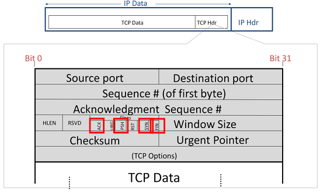

由于TCP需要提供双向可靠、有序的字节流服务，因此其报头要比IP包头复杂得多。

| 字段                             | 说明                                                         |
| -------------------------------- | ------------------------------------------------------------ |
| `Destination port`               | 通信对端应用的端口，例如HTTP服务端口为80、SSH服务端口为22    |
| `Source port`                    | 本端应用的端口                                               |
| `Sequence number`                | TCP数据字段中第一个字节在字节流中的位置                      |
| `Acknowledgment sequence number` | 告知对端下一个期望收到的字节序列号，同时也表明该序列号之前的数据已经被成功接收 |
| `Checksum`                       | 在整个段上计算的校验和，用来帮助接收方检查数据是否缺损       |
| `Header Length`                  | 包头的长度，由于有`Options`字段选项，TCP包头可能会变化       |
| `Flags`                          | 一系列标志位，其中`ACK`表示确认号是否有效，`PSH`表示是否应该尽快将数据交给应用层，`RST`表示连接复位请求，`SYN`表示同步序列号请求，`FIN`表示发送方已经没有数据需要传送，并要求释放连接 |

## 1.6 TCP连接的标识ID

TCP连接在TCP和IP头中由五个信息唯一标识，即**源IP地址、目的IP地址、协议ID（是TCP还是UDP）、源Port和目的Port**。

> 也有说TCP连接是用四元组标识的，即去掉上面的协议ID。

端口号包含16位，因此客户端最多能与服务端的同一个应用建立64K新连接，若超过了则会出现重复的端口。如果发生这种情况，一个连接的字节可能会与另一个连接的字节混淆。为了降低混淆的可能性，TCP连接会使用随机初始序列号来指代字节流中的字节，这样能做一定程度上避免这种混淆。

## 1.8 序列号

TCP segment的序列号指该段中数据的第一个字节的序列号，该序列号是初始序列号偏移后得到的。TCP的确认序列号指期望收到的下一个字节的序列号。

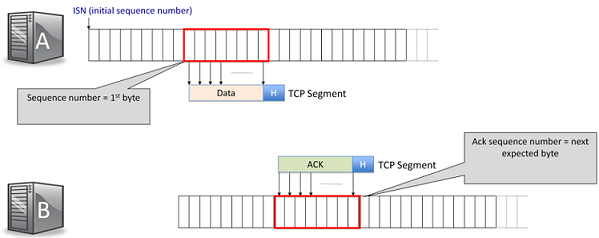

# 2.UDP服务模型

**UDP（User Datagram Protocol）** 是另一个传输层协议。UDP被用于不需要TCP保证传递服务的应用程序，这可能是因为该应用程序使用自己的私有方式处理重传，或者仅仅因为该应用程序不需要可靠的传递。UDP要比TCP简单得多。

> DNS便是使用的UDP进行通信，当DNS客户端向DNS服务器发送查询请求时，通常使用UDP协议进行传输。这是因为DNS查询通常很小，可以适应UDP数据报的限制，并且在大多数情况下，速度和效率比TCP更高。

## 2.1 UDP数据报格式

UDP数据报格式如下所示

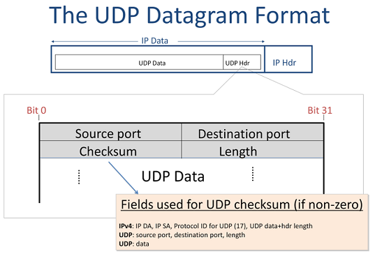

UDP包头字段含义如下

| 字段               | 说明                                                         |
| ------------------ | ------------------------------------------------------------ |
| `Source port`      | 指示数据来自哪个应用程序                                     |
| `Destination Port` | 指示数据需要发送给对端主机的哪个应用                         |
| `Chechsum`         | 校验和，可选字段，如果发送方不包括校验和，则该字段填充全零。否则它将计算UDP头和数据上的校验和 |
| `Length`           | 指整个UDP数据报的字节长度                                    |

事实上，UDP校验和计算也**包含了IPv4头部的一部分（源IP、目的IP和协议ID）**。这样做实际违反了分层原则，但这样可以使得UDP层可以检测到被传递到错误目标的数据报。

## 2.2 UDP服务属性

下表总结了UDP的属性

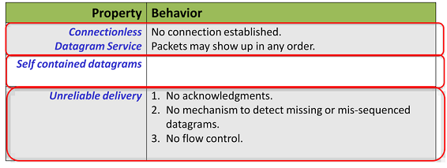

UDP提供**无连接（conectionless）** 的数据报服务。

UDP的数据包是**自包含的（self-contained）** 。

UDP是**不可靠（unreliable）** 的数据传送服务。UDP不发送任何确认消息来告知数据已到达另一端。它没有检测丢失数据报的机制。如果整个数据报在传输途中被丢弃，UDP将不会通知应用程序，并且也不会要求源重新发送数据报。

# 3 ICMP服务模型

网络层得以Work注意依赖如下三大部分

- **IP**：创建IP数据报、从端到端逐跳传递。
- **路由表**：用来帮助进行数据包转发。
- **ICMP**：在端主机和路由器之间传输网络层信息、报告错误条件和帮助诊断问题。

ICMP（Internet Control Message Protocol）主要用于**在IP网络中传输控制信息和错误消息**。ICMP常用于诊断网络故障和测试网络连接，例如`ping`命令就是利用ICMP协议来测试目标主机是否可达。

ICMP运行在网络层之上，因此严格来说，它是一个**传输层协议**。当对端主机或路由器要使用ICMP报告错误时，它会将想要发送回源的消息放入ICMP payload中，然后将其传递给IP。

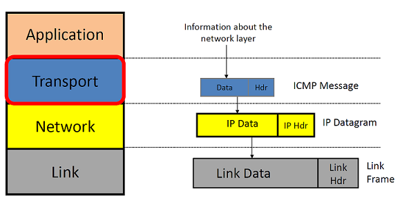

下面是一个例子，假定源主机有一个客户端应用程序要访问HTTP服务器，其递交的数据回依次由TCP层、Network层和Link层处理后，沿着链路出去到达路由器，但是路由器的转发表中没有关于目标网络的任何信息，使得路由器不知道如何转发，若发生这种情况，路由器将发送回一条消息给A告知其目标网络不可达。

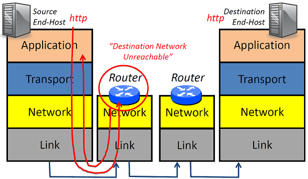

## 3.1 ICMP服务

ICMP服务属性总结如下表

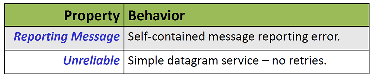

ICMP允许**报告自包含的错误消息**，当然从发送简单数据报的意义上说，这是**不可靠**的。

## 3.2 常见的ICMP消息类型

常见的ICMP消息类型总结如下

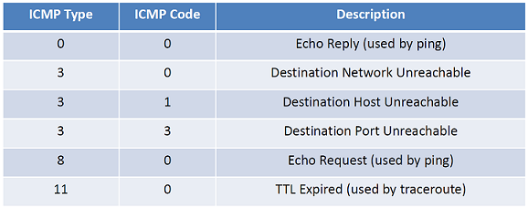

## 3.3 `ping`的工作原理

`ping`是一种基于ICMP的网络工具，用于**测试主机之间的连通性**，其工作原理如下:

- 发送端发送一个ICMP Echo Request消息给目标主机，并设置一个初始时间戳。
- 目标主机接收到Echo请求消息后，返回一个ICMP Echo Reply消息给发送端，表示收到了请求。
- 发送端接收到Echo reply消息后，记录下接收时间，并计算出从发送请求到接收回复所经过的时间，即**往返时间（RTT）**。
- 发送端还可以通过ICMP消息中的TTL字段来检测到达目标主机所需要的路由跳数。在每个路由器上，TTL值都会减少1，如果TTL被减少到0，则路由器将丢弃该消息，并向发送方发送一个ICMP Time Exceeded消息。
- 通过多次执行上述步骤，可以得出平均往返时间和丢包率等网络质量指标，以评估网络的稳定性和可靠性。

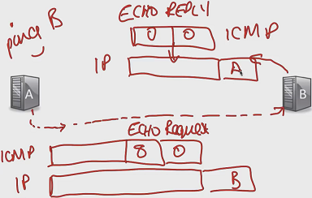

## 3.4 `traceroute`的工作原理

`traceroute`是一种网络诊断工具，用于**确定从本地主机到特定目标主机的路径**。它通过发送UDP数据包到目标主机，并记录每个路由器的**IP地址、响应时间和TTL（Time to Live）值**。

`traceroute`的工作原理如下：

- `traceroute`发送第一个数据包，将TTL设置为1，发送到目标主机。
- 当第一个数据包到达第一个路由器时，路由器会将TTL减少1，此时TTL值为0，路由器会丢弃该数据包，并将错误报告消息发回给源主机。
- 然后源主机继续发送UDP数据包，将TTL设置为2，当到达第二个路由器时，TTL减为0，同样回传错误消息。
- 重复上述步骤，直至到达目标主机，由于UDP数据包会选择一个目标主机不会知道的端口，以便目标主机发回消息ICMP port unreachable。

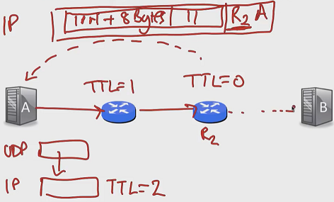

# 4 端到端准则

网络的端到端准则是指，在网络中，**每个节点只负责本地的处理和转发数据**，并不依赖于其他节点的状态或信息。网络的工作是尽可能高效和灵活地传输数据报。其他所有操作应在网络边缘完成。

# 5.误差检测

网络不是完美的，运行在网络上的主机也不是完美的。它们可能会引入错误，为了使网络能够正常运行，它需要能够检测这些错误。

现今的网络通常使用三种不同的错误检测算法：

- **校验和（checksums）**  
- **循环冗余码（cyclic redundancy codes, CRCs** 
- **消息认证码（message authetication codes, MACs）** 

误差检测指给定一组数据负载，在这些数据上计算一些错误检测位，然后将其附加到数据负载的末尾或开头。例如Etherent添加了CRC，传输层安全协议TLS附加了消息认证码，而IP则在头部放置校验和。TLS和以太网都有一个尾部，用于存储协议信息，跟随数据负载之后，其中包括它们存放CRC和MAC的位置。

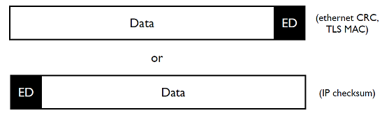

## 5.1 校验和

**使用对象**：IP、UDP、TCP。

**校验和（checksums）** 通常是通过对数据包中的每个16位字（即2个字节）进行二进制求和来计算的。如果结果超过了16位，那么将溢出的部分加回到低位中，直到结果在16位范围内。然后，将结果取反得到最终的校验和值。

**优点**：快速、易于计算和验证。

**缺点**：鲁棒性（robust）不是特别好。仅能保证检测到单比特错误，虽然能够检测其他错误，但实际的保证既薄弱又复杂。

## 5.2 CRC

**使用对象**：Link Layer。

**冗余循环码（CRC）** 比校验和的计算代价更高，但同时也更健壮可靠。

CRC的简单计算流程如下：

- 选择一个生成多项式$G$，例如$x^32+x^26+x^23+x^22+x^16+x^12+x^11+x^10+x^8+x^7+x^5+x^4+x^2+x+1$；
- 将待校验数据$D$和$G$做模2除法，得到余数$R$；
- 将余数$R$作为校验码添加到原始数据$D$的末尾，得到发送数据。

## 5.3 MAC

**消息认证码（MAC）** 是一种用于验证数据完整性和身份验证的技术。MAC对恶意修改具有很强的鲁棒性，它用于传输层安全性协议（TLS），也就是浏览网络时使用的HTTPS。

大多数消息认证码的背后思想是，两个双方共享一个秘密$s$。这个秘密仅是一组随机生成的比特（随机的以便于猜测困难）。要计算一个消息认证码$c$，将MAC算法应用于消息$M$和秘密$s$。如果没有$s$，则很难为消息$M$生成正确的$c$。

# 6.有限状态机

## 6.1 什么是有限状态机

**有限状态机（finite state machine, FSM）** 由有限数量的状态组成。状态指系统的特定配置。

下述例子中包含3个状态，状态之间的便定义了它们之间的转移方式，每条边需要指定**导致转移发生的事件**（横线上方），此外也可以说明**系统在该转换发生时将执行那些操作**（横向下方，可选的）。

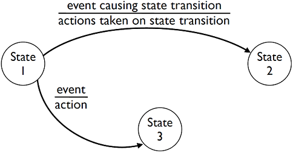

## 6.2 关于TCP连接的有限自动机

下图展示的便是TCP连接对应的有限状态机：

该有限状态机中包含12个状态。该图实际上有4个部分：

- 顶部的四个状态描述了**如何建立一个TCP连接**。
- 中心状态`ESTABLISHED`指**TCP正在发送和接收数据**。
- 蓝色区域的6个状态描述了**如何关闭连接**。
- 最底部的`CLOSED`状态标识**连接已经关闭**。

### 6.2.1 三次握手

状态图的顶部描述了**TCP在TCP三次握手的两端的行为**。

被动打开方是指服务器，它监听来自主动打开方（客户端）的连接请求。因此，当程序调用`listen()`时，套接字会从橙色的`CLOSED`状态转换到黄色的`LISTEN`状态。如果服务器在套接字处于监听状态时调用`close()`，则立即将其转换为`CLOSED`状态。

**第一次握手**：当客户端发送`SYN`请求时（调用`connect`函数），客户端由`CLOSED`状态转移到`SYN SENT`状态。当`SYN`请求到达服务器时，服务器便从`LISTEN`状态转移至`SYN RECEIVED`状态，此外服务器端将采取行动，即发送`SYN/ACK`消息作为回复。

**第二次握手**：处于`SYN SENT`状态的客户端收到`SYN/ACK`消息后将转移至`ESTABLISHED`状态。

**第三次握手**：处于`ESTABLISHED`状态的客户端会发送`ACK`消息给服务端。处于`SYN RECEIVED`状态的服务器端收到来自客户端的`ACK`后，其状态也转移至`ESTABLISHED`。

### 6.2.2 四次挥手

在四次挥手中，主动发起的一方的状态位于左侧的蓝色区域，另一方的状态位于右侧的蓝色区域。

**第一次挥手**：主动方调用`close()`后进入`FIN WAIT 1`状态并发送`FIN`包给另一端。

**第二次挥手**：对端（被动方）收到`FIN`包后会进入`CLOSE WAIT`状态，并发送`ACK`包作为回应。

**第三次挥手**：处于`FIN WAIT 1`状态的主动方有三种可能的转移结果：

- 主动方仅收到了`ACK`回复，被动方位于`CLOSE WAIT`状态仍然可以继续发送数据，此时主动方进入`FIN WAIT 2`状态。
- 若被动方没有其他待发送的数据，则会回复`ACK`后也发起`FIN`请求，此时，主动方收到`FIN`请求后会进入`TIME_WAIT`状态，被动方发送`FIN`请求后，会进入`LAST ACK`状态。
- 若双方同时发起关闭连接并向对方发送了`FIN`，双方都处于`FIN WAIT 1`状态。每个人都会看到来自另一方的`FIN`，并没有`ACK`自己的`FIN`。在这种情况下，主动方会过渡到`CLOSING`状态，当`FIN`得到确认时，主动方才会过渡到`TIME_WAIT`状态。被动方发送`FIN`请求后，会进入`LAST ACK`状态

**第四次挥手**：被动方的`FIN`请求被确认会转移到`CLOSED`状态。主动会在`TIME WAIT`状态下等待一段时间，然后也转移到`CLOSED`状态。

