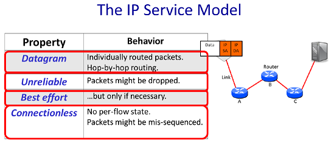
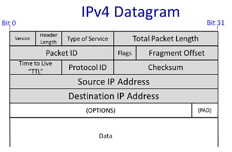

# 1.网络应用

网络应用可以在世界范围内交换数据，例如你可以通过浏览器读取出版社服务器提供的文章。网络应用的基本模型：两台主机各自在本地运行一个程序，程序通过网络来通信。

最常用的通信模型使用**双向可靠字节流**，通信的两台主机可以想对方发送数据或读取对方发送过来的数据，双方也都可以主动断开连接。

## 1.1 典型的网络应用

**World Wide Web（万维网）**

万维网通过**HTTP（HyperText Transfer Protocol）** 工作。在HTTP中，客户端与服务器间建立连接，然后发送请求。例如通过`GET`请求斯坦福大学的主页`http://www.stanford.edu/`，在该过程中，首先浏览器需要与服务器`www.stanford.edu`建立连接，然后发送`GET`请求，然后服务器接收请求是否合法，用户是否能获取，然后回复响应。响应会带有一个数字码，例如`200`表示响应成功，`404`表示没找到用户请求的文件。

------

**BitTorrent**

BitTorrent允许共享和交换大文件。在BitTorrent中，客户端从其他客户端请求文档，因此**单个客户端可以并行地向许多其他客户端请求数据**。

BitTorrent将文件切分成**块（pieces）**，当一个客户端从另一个客户端下载了一个完整的块，该客户端随后会告知其他客户端其上有这个块，其他客户端可以来下载。这些协作的客户端称之为**集群（swarms）**。

与WWW一样，BitTorrent同样使用可靠、双向的数据流，但它更为复杂。当一个客户端想下载一个文件，其首先需要找到称之为torrent文件，该文件描述了你想要下载的文件的某些信息。它还告诉BitTorrent谁是该 torrent 的**跟踪器（Tracker）**。跟踪者记录了谁是集群的成员。为了加入一个torrent，客户端首先需要与tracker通信，请求集群的客户端列表。然后客户端本地与客户端列表的某些建立连接并请求数据。反过来，这些客户端同样也可以向本地客户端请求文件。此外，当有新客户端加入集群时，tracker会告知本地客户端。

------

**Skype**

Skype提供语音、聊天和视频服务。与万维网在客户端和服务器间建立连接通信不同，Skype是在两台客户端间建立连接（个人PC）。例如下图，两台客户端建立连接然后就可以进行双向的数据交换。

但当引入NAT（Network Address Translator，网络地址转换器）之后，两台客户端通过Skype通信将有所不同。

> NAT可以将内网IP转换为公网IP，NAT后的内网主机可以打开与Internet的请求，但Internet上的其他节点却不能主动地打开到NAT后主机的连接。

**只有一端有NAT的情况**：通过**Rendezvous服务器**来解决。当登录到Skype，客户端B会建立与Rendezvous服务器的连接（NAT后的主机可以打开与Internet节点的连接），因此当客户端A呼叫客户端B时，它将发送消息给Rendezvous服务器。客户端B上弹出呼叫对话框。若客户端B接受了呼叫，其会主动建立与客户端A的连接。

**两端都位于NAT的情况**：通过**Relay服务器**解决，注意Relay不位于NAT后。位于NAT的客户端A和客户端B都会建立与Relay服务器的连接，当客户端A发送数据时，Relay服务器将该消息转发到其与客户端B建立的连接中。

# 2.四层网络模型

## 2.1 模型概览

4层网络模型概览如下

**Link Layer（网络接口层）**：Internet由主机、交换机和路由器组成，数据需要在链路上逐跳传递。而Link Layer的工作便是在链路上传递数据包。

**Network layer（网络层）**：负责将数据从一个设备传输到另一个设备（端到端）。网络层上的数据包称为packet，其包含了数据和IP（Internet Protocol）包头，其中包头描述了数据是什么，它要去哪里，它来自哪里。在网络层中必须使用IP协议，需要注意的是，**IP只是尽最大努力将报文发送给对端，但其并不承诺一定送达**。

**Transport Layer（传输层）**：最常用的传输层协议为**TCP（Transmission Control Protocol）**，TCP确保发送的包正确地、有序地发送到对端，若网络层丢失了某些包，TCP层需要对丢失的包进行重传。但并不是所有应用都需要数据的正确传递。例如视频会议容许丢包，因此，并不是所有的应用都需要TCP。若应用不需要数据完全可靠的送达，可以使用更简单的**UDP（User Datagram Protocol）**，UDP不提供传输保证。

**Application Layer（应用层）**：专注于为用户提供特定的功能（HTTP，FTP）。

------

在4层网络模型中，**每层都与其对同层进行通信，就好像每个层只与链路或互联网另一端的同一层进行通信，而不考虑下面的层如何将数据送到那里**。当应用层有数据要发送时，会将数据传递给传输层，传输层确保可靠（或不可靠）的数据传送，传输层会将数据传递给网络层，其会将数据切分为packets（只有使用UDP时才可能在网络层切分），然后给每个packet加上目的地址，最终packet被传递给网络接口层，其负责逐跳的传送数据。

------

## 2.2 对IP的补充

IP经常被叫做“**瘦腰（the thin waist）**”，因为若想使用Internet，必须使用IP协议，但其下的网络接口层和其上的传输层和应用层都有很多选项。

## 2.3 OSI 七层网络模型

OSI 7层网络模型与4层网络模型的对应关系

# 3.IP服务

IP数据报（datagram）包含了包头和某些数据。当传输层有数据要发送时，会将Segment传递给网络层。网络层在Segment的基础上添加IP报头得到IP数据报。然后将该数据报传递给Link层，Link层会将其置于Link frame内然后将其传给网卡发送出去。

> 数据包在Link层被称之为frame、在Network层被称之为packet、在TCP层被称之为Segment。

## 3.1 IP服务属性

IP服务模型的4大属性概况如下

**数据报（Datagram）**：IP是数据报服务，当向IP请求发送数据时，其会创建一个数据报并将待发送的数据放入其中。数据报是根据其报头中的信息**通过网络单独路由**的packet，即数据报与数据报是相互独立的（self-contained）。报头会包含目的IP地址，每个路由器的转发选择都是基于目的IP，同时报头也包含了源IP地址，指示该数据报来自哪里，以便发送回复。数据报经过逐跳路由从源地址发送到目标地址。在每个路由器中，都包含了一个转发表，其指示了该数据包要向何处转发，才能被送至目标地址。

**不可靠（Unreliable）**：IP不承诺将packets送达至目的地。数据包可能会被延迟交付、乱序交付或根本不交付。

**最大努力（Bert Effort）**：IP并不会随意地丢弃packets，其承若只有在必要时丢弃packets。导致丢包的例子：

- 由于拥塞导致路由器上的packet队列满了，使得其会强制丢弃下一个到达的packet。需要注意的是，IP不会尝试重新发送数据，甚至不会告诉源主机数据包已丢失。
- 错误的路由表使得packet被发送到错误的地址。

**无连接的（connectionless）**：IP不维护与通信相关的任何状态。例如当进行一个持续数十分钟的Skype通话，其包含了许多packets，但IP层对该童话并不了解，只是将每个packet独立的进行路由。

## 3.2 为什么IP服务如此简答？

**原因一**：要保持网络的简单、愚蠢（dumb）和最小化。使得更快，更精简，建设和维护成本也更低。考虑到网络是由分散在整个网络中的大量路由器实现的，如果它们能够保持简单，那么可能会更可靠，维护费用更低，而且需要升级的频率也更低。

**原因二**：端到端（end-to-end）原则，该原则在通信系统非常常见。若能正确地在端（end points）实现，就应该这样做。这样做有几个好处，例如若功能是在终端计算机上实现，而不是在实现在互联网硬件上，则更容易发展和改进。

**原因三**：允许在上面建立各种可靠（或不可靠）的服务。若IP是可靠的，但某些服务并不要求可靠，这样就对这些应用不太友好。

**原因四**：IP需要能工作在各种Link层上，其对Link层的假设非常少。

## 3.3 IP服务的其他特征

**IP试图防止数据包永远循环下去**。为做到这点，IP在数据报的报头添加了一个跳数字段，即**TTL（Time to Like）**，数据报每经过一个路由器，该字段就会减去1，当该字段值为零时，该数据报将会被丢弃。

**如果数据报太长，IP会对其进行分片处理**。IP被设计为可以运行在任何link上，大多数link对可传输的packet的大小都有限制。若数据报太大，IP会对数据报进行分片，IP在包头也提供了相应的头字段使得分片的数据能再次正确地重新组合。

**IP使用报头校验（checksum），以减少将数据报传送到错误目的地的概率**。

**IP支持IPv4（32字节）和IPv6（128字节）**。

**IP允许在报头添加新的字段**。一方面它允许新的功能被添加到头中，另一方面这些字段需要处理，因此需要路径上的路由器的额外功能，打破了简单、愚蠢、最小转发路径的目标。

## 3.4 IPv4数据报

IPv4数据报的header如下所示

字段说明

| 字段                              | 说明                                                         |
| --------------------------------- | ------------------------------------------------------------ |
| Source IP Address                 | 源IP地址                                                     |
| Destination IP Address            | 目的IP地址                                                   |
| Protocol ID                       | 协议ID，TCP为6、UDP为17                                      |
| Version                           | IP的版本，即IPv4或IPv6                                       |
| Total Packet Length               | 数据报长度                                                   |
| TTL                               | 数据报能经过的最大路由器数，防止循环                         |
| Packet ID、Flags、Fragment Offset | 帮助路由器在必要时将IP数据包分割成更小的独立数据包           |
| Type of Service                   | 指示数据包的重要程度                                         |
| Header Length                     | 指示头部的长度，因为可能会添加额外的选项字段                 |
| Checksum                          | 用来对报头进行校验，以便在报头被破坏时，不将数据包送到错误的目的地 |

