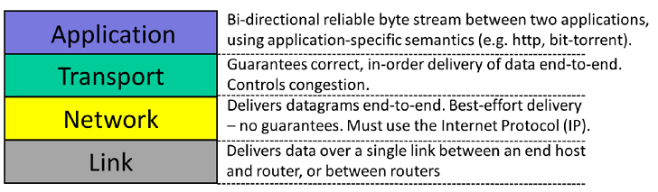
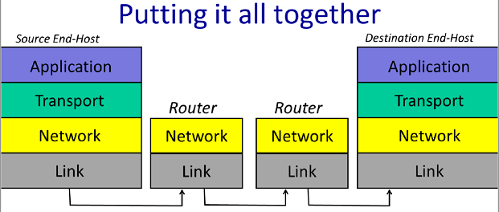
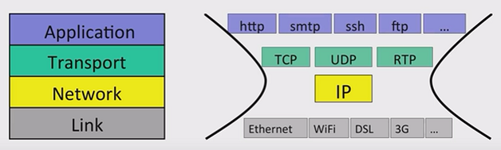
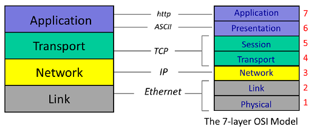

# 网络应用

> Networked Applications

网络应用可以在世界范围内交换数据，例如你可以通过浏览器读取出版社服务器提供的文章。

网络应用的基本模型：两台主机各自在本地运行一个程序，程序通过网络来通信。

最常用的通信模型使用**双向可靠字节流**，通信的两台主机可以想对方发送数据或读取对方发送过来的数据，双方也都可以主动断开连接。

## 典型的网络应用

**World Wide Web（万维网）**

万维网通过**HTTP（HyperText Transfer Protocol）** 工作。在HTTP中，客户端与服务器间建立连接，然后发送请求。例如通过`GET`请求斯坦福大学的主页`http://www.stanford.edu/`，在该过程中，首先浏览器需要与服务器`www.stanford.edu`建立连接，然后发送`GET`请求，然后服务器接收请求是否合法，用户是否能获取，然后回复响应。响应会带有一个数字码，例如`200`表示响应成功，`404`表示没找到用户请求的文件。

------

**BitTorrent**

BitTorrent允许共享和交换大文件。在BitTorrent中，客户端从其他客户端请求文档，因此**单个客户端可以并行地向许多其他客户端请求数据**。

BitTorrent将文件切分成**块（pieces）**，当一个客户端从另一个客户端下载了一个完整的块，该客户端随后会告知其他客户端其上有这个块，其他客户端可以来下载。这些协作的客户端称之为**集群（swarms）**。

与WWW一样，BitTorrent同样使用可靠、双向的数据流，但它更为复杂。当一个客户端想下载一个文件，其首先需要找到称之为torrent文件，该文件描述了你想要下载的文件的某些信息。它还告诉BitTorrent谁是该 torrent 的**跟踪器（Tracker）**。跟踪者记录了谁是集群的成员。为了加入一个torrent，客户端首先需要与tracker通信，请求集群的客户端列表。然后客户端本地与客户端列表的某些建立连接并请求数据。反过来，这些客户端同样也可以向本地客户端请求文件。此外，当有新客户端加入集群时，tracker会告知本地客户端。

------

**Skype**

Skype提供语音、聊天和视频服务。与万维网在客户端和服务器间建立连接通信不同，Skype是在两台客户端间建立连接（个人PC）。例如下图，两台客户端建立连接然后就可以进行双向的数据交换。

但当引入NAT（Network Address Translator，网络地址转换器）之后，两台客户端通过Skype通信将有所不同。

> NAT可以将内网IP转换为公网IP，NAT后的内网主机可以打开与Internet的请求，但Internet上的其他节点却不能主动地打开到NAT后主机的连接。

**只有一端有NAT的情况**：通过**Rendezvous服务器**来解决。当登录到Skype，客户端B会建立与Rendezvous服务器的连接（NAT后的主机可以打开与Internet节点的连接），因此当客户端A呼叫客户端B时，它将发送消息给Rendezvous服务器。客户端B上弹出呼叫对话框。若客户端B接受了呼叫，其会主动建立与客户端A的连接。

**两端都位于NAT的情况**：通过**Relay服务器**解决，注意Relay不位于NAT后。位于NAT的客户端A和客户端B都会建立与Relay服务器的连接，当客户端A发送数据时，Relay服务器将该消息转发到其与客户端B建立的连接中。

# 4层网络模型

4层网络模型概览如下

**Link Layer（网络接口层）**：Internet由主机、交换机和路由器组成，数据需要在链路上逐跳传递。而Link Layer的工作便是在链路上传递数据包。

**Network layer（网络层）**：负责将数据从一个设备传输到另一个设备（端到端）。网络层上的数据包称为packet，其包含了数据和IP（Internet Protocol）包头，其中包头描述了数据是什么，它要去哪里，它来自哪里。在网络层中必须使用IP协议，需要注意的是，**IP只是尽最大努力将报文发送给对端，但其并不承诺一定送达**。

**Transport Layer（传输层）**：最常用的传输层协议为**TCP（Transmission Control Protocol）**，TCP确保发送的包正确地、有序地发送到对端，若网络层丢失了某些包，TCP层需要对丢失的包进行重传。但并不是所有应用都需要数据的正确传递。例如视频会议容许丢包，因此，并不是所有的应用都需要TCP。若应用不需要数据完全可靠的送达，可以使用更简单的**UDP（User Datagram Protocol）**，UDP不提供传输保证。

**Application Layer（应用层）**：专注于为用户提供特定的功能（HTTP，FTP）。

------

在4层网络模型中，**每层都与其对同层进行通信，就好像每个层只与链路或互联网另一端的同一层进行通信，而不考虑下面的层如何将数据送到那里**。当应用层有数据要发送时，会将数据传递给传输层，传输层确保可靠（或不可靠）的数据传送，传输层会将数据传递给网络层，其会将数据切分为packets（只有使用UDP时才可能在网络层切分），然后给每个packet加上目的地址，最终packet被传递给网络接口层，其负责逐跳的传送数据。

------

IP经常被叫做“**瘦腰（the thin waist）**”，因为若想使用Internet，必须使用IP协议，但其下的网络接口层和其上的传输层和应用层都有很多选项。

------

OSI 7层网络模型与4层网络模型的对应关系

