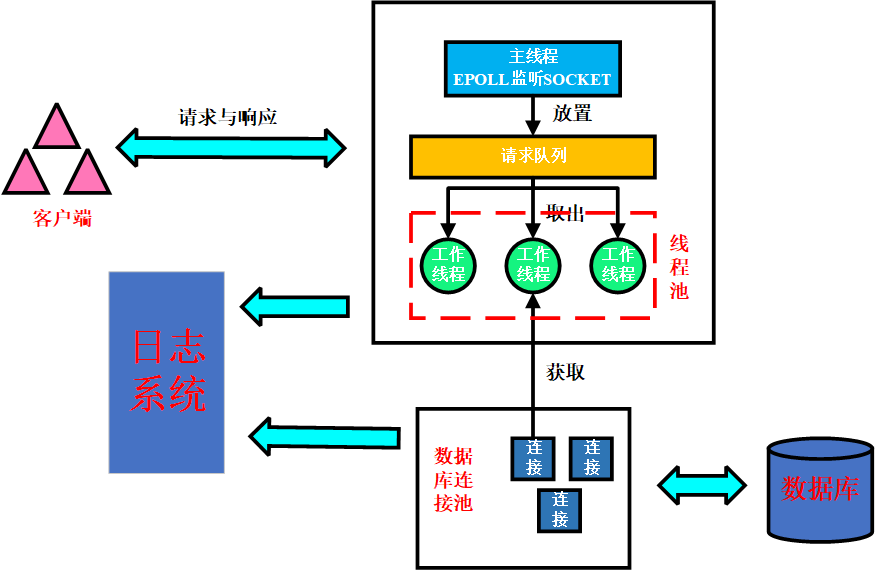

# 项目概述

本项目实现了一个Linux下的C++轻量级Web服务器，在该服务器中：

- 使用 **线程池 + 非阻塞`socket` + `epoll`(ET和LT均实现) + 事件处理(Reactor和模拟Proactor均实现)** 的并发模型
- 使用**状态机**解析HTTP请求报文，支持`GET`和`POST`请求。
- 接入MySQL数据库，使得能实现Web端用户的**注册、登录、修改密码**等功能，此外，还可以向该服务器**请求图片/视频文件**。
- 还实现了**同步/异步**日志系统，记录服务器运行状态。

# 项目详情

**环境依赖:**

```shell
OS: Ubuntu
GCC: 7.5.0 (要求c++11及yi)
MySQL: 5.7.42
```

**项目大致框架如下**：

<p align="center"></p>

**项目各模块详解**：

- [线程同步机制包装类](./lock/readme.md)
- [HTTP连接请求处理类](./http_conn/readme.md)
- [事务处理线程池](./thread_pool/readme.md)
- [定时器处理非活跃连接](./timer/readme.md)
- [同步/异步日志系统](./log/readme.md)
- [数据库连接池](./db/readme.md)


# 系统演示

## 系统运行

**步骤1**：在MySQL数据库中创建用户密码存储表：

```sql
// 建库
CREATE DATABASE web_service;

// 创建user表
USE web_service;
CREATE TABLE user(
    username char(50) NULL,
    password char(50) NULL
);
```

**步骤2**：修改`main.cpp`中的数据库初始化信息：

```c++
string user = "your_user_name";
string passwd = "your_user_password";
string databasename = "web_service";
```

**步骤3**：编译运行：

```shell
make
```

**步骤4**：启动服务器:

```shell
./server [-p port] [-l LOGWrite] [-m TRIGMode] [-o OPT_LINGER] [-s sql_num] [-t thread_num] [-c close_log] [-a actor_model]
```

参数说明：

| 参数 | 参数说明                                                     |
| ---- | ------------------------------------------------------------ |
| `-p` | 自定义端口号，默认为`9006`                                   |
| `-l` | 选择日志写入方式，默认同步写入`0`，可用选项为：`0: 同步写入 1: 异步写入` |
| `-m` | `listenfd`（监听套接字）和`connfd`（连接套接字）的模式组合，默认`LT+LT`<br>可用选项为：`0: LT + LT 1: LT + ET 2: ET+ LT 3: ET + ET` |
| `-o` | 优雅关闭连接，默认不使用`0`。可用选项为`0: 不适用 1: 使用`   |
| `-s` | 数据库连接池的连接数，默认为`8`                              |
| `-t` | 线程池线程数，默认为`8`                                      |
| `-c` | 是否打开日志，默认打开`0`。可用选项为`0: 打开日志 1: 关闭日志` |
| `-a` | 高性能网络模式选择，默认为`0`，可用选项为`0: Proactor 1: Reactor` |

**说明**：在运行上述命令后，便可以经`your_id:your_port`在浏览器中请求服务。

## 功能展示

下面的GIF展示了**注册与登录、查看图片、查看视频、修改密码**等功能：

<p align="center"></p>

## 压测展示

WebBench是一款HTTP服务器压测工具

```shell
wget http://home.tiscali.cz/~cz210552/distfiles/webbench-1.5.tar.gz
tar zxvf webbench-1.5.tar.gz
cd webbench-1.5
make install
```

在关闭日志后，使用WebBench对服务器进行压力测试，对listenfd和connfd分别采用ET和LT模式，均可实现上万的并发连接。

```shell
####Proactor模式
./server -c 1 -a 0 -m 0 # LT + LT
./server -c 1 -a 0 -m 0 # LT + ET
./server -c 1 -a 0 -m 0 # ET + LT
./server -c 1 -a 0 -m 0 # ET + ET

####Reactor模式
./server -c 1 -a 1 -m 0 # LT + LT
./server -c 1 -a 1 -m 0 # LT + ET
./server -c 1 -a 1 -m 0 # ET + LT
./server -c 1 -a 1 -m 0 # ET + ET

# webbench测试命令
webbench -c 10500 -t 5 http://172.31.18.178:9006/
```

测试结果为：

| 模式               |      |      | 成功的请求数 |      |
| ------------------ | ---- | ---- | ------------ | ---- |
| `Proactor LT + LT` |      |      |              |      |
| `Proactor LT + ET` |      |      |              |      |
| `Proactor ET + LT` |      |      |              |      |
| `Proactor ET + ET` |      |      |              |      |
| `Reactor LT + LT`  |      |      |              |      |
| `Reactor LT + ET`  |      |      |              |      |
| `Reactor ET + LT`  |      |      |              |      |
| `Reactor ET + ET`  |      |      |              |      |
